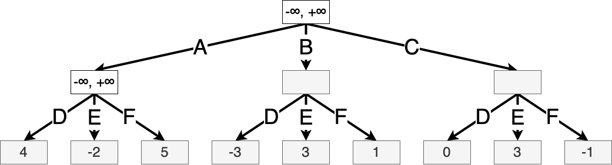
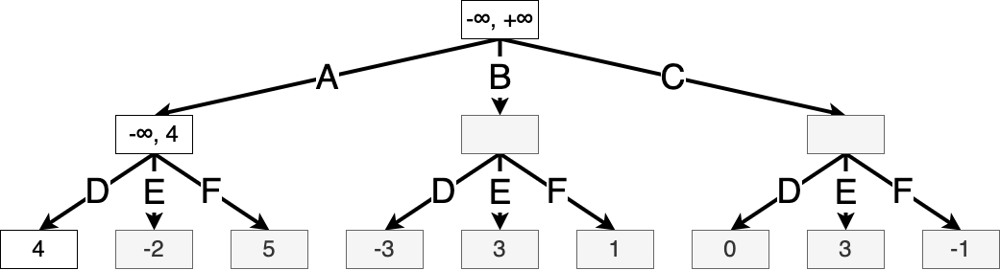
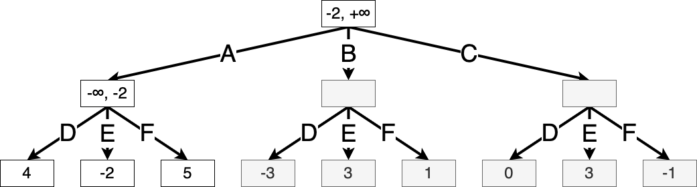

---
jupytext:
  text_representation:
    extension: .md
    format_name: myst
    format_version: 0.13
    jupytext_version: 1.16.2
kernelspec:
  display_name: Python 3 (ipykernel)
  language: python
  name: python3
numbering:
  enumerator: 8.%s
---


# 8 Planning


:::{warning}
This chapter is a WORK IN PROGRESS.
:::

## Introduction

Have you ever lost a strategy game against a skilled opponent?
It probably seemed like they were ahead of you at every turn.
They might have been _planning ahead_ and anticipating your actions,
then planning around them in order to win.
If this opponent was a computer,
they might have been using one of the strategies in this chapter.

This chapter is heavily inspired by Chapter 5 of {cite}`russell_artificial_2021`.
We will focus on games that are:

- for _two players_ that alternate turns,
- _deterministic,_
- _zero sum_ (one player wins and the other loses),
- and _fully observable,_ that is, the state of the game is perfectly known by both players.

We can represent such a game as a _complete game tree._
Each path through the tree, from root to leaf, represents a single game.

:::{figure} shared/tic_tac_toe.png
:align: center

The first two layers of the complete game tree of tic-tac-toe.
From Wikimedia.
:::

If you could store the entire game tree and perfectly predict the outcome of every move,
you would be able to win every game (if possible).
However, as games become more complex,
it becomes computationally impossible to search every possible path.
Later in this chapter,
we will explore ways to _prune away_ parts of the tree that we know are suboptimal,
as well as ways to _approximate_ the value of a state.

We'll follow the convention of naming the two players Max and Min.
Max seeks to maximize the final game score,
while Min seeks to minimize the final game score.
We'll borrow most of the notation from the [](./mdps.md) chapter,
treating such games as finite-horizon MDPs.
The reward $r(s)$ comes only at the end of the game ($\hi = \hor$)
and is $+1$ if Max wins and $-1$ if Min wins.
The state transitions are _deterministic_ i.e. $s_{\hi+1} = P(s_\hi, a_\hi)$.
We assume the state indicates which player's turn it is.


## Min-max search

The optimal value function of a given state at a given timestep,
_playing as Max,_
$V_\hi^{\star}(s)$,
is also called its _minimax value._
This assumes that Min always acts optimally,
that is,
each player assumes the other is acting in their own best interest.

$$
V_\hi^{\star}(s) = \begin{cases}
r(s) & \hi = \hor \\
\max_{a \in \mathcal{A}} V_{\hi+1}^{\star}(P(s, a)) & \text{it is Max's turn} \\
\min_{a \in \mathcal{A}} V_{\hi+1}^{\star}(P(s, a)) & \text{it is Min's turn} \\
\end{cases}
$$

This translates directly into a recursive depth-first search algorithm for searching the game tree.

```python
def minimax_search(s, player) -> Tuple["Action", "Value"]:
    """Return the value of the state (for Max) and the best action for Max to take."""
    if env.is_terminal(s):
        return None, env.winner(s)

    if player is max:
        a_max, v_max = None, None
        for a in actions:
            _, v = minimax_search(env.step(s, a), min)
            if v > v_max:
                a_max, v_max = a, v
        return a_max, v_max
    else:
        a_min, v_min = None, None
        for a in actions:
            _, v = minimax_search(env.step(s, a), max)
            if v < v_min:
                a_min, v_min = a, v
        return a_min, v_min
```

At each of the $\hor$ timesteps,
this algorithm iterates through the entire action space,
and therefore has a time complexity of $\hor^{|\mathcal{A}|}$.
This makes it impractical for even moderately sized games.
For instance,
a chess player has roughly 35 actions to choose from,
and each game takes roughly 40 moves per player,
so trying to solve chess exactly using minimax
would take somewhere on the order of $35^{80} \approx 10^{123}$ operations.
Suffice it to say that computing this would be an impressive feat.

How can we start to trim down the search tree,
that is,
the subgraph that we actually need to traverse?
We might not need to expand actions if we already know of better options.
The **alpha-beta search** makes use of this intuition.

## Alpha-beta search

Consider a simple game that consists of just one move by Max and one move by Min. Each player has three available actions. Each pair of moves leads to a different integer outcome.
Max tries to find the optimal action using a depth-first search.
They imagine taking the first action,
and then imagine each of the actions that Min could take.
They know that Min will choose whichever option minimizes Max's score.
Thus the value of taking the first action is updated exactly:





Then Max imagines taking the second action.
Once again, they imagine each of the actions that Min could take,
in order.
They find that the first of Min's actions in this state leads to a _worse_ outcome (for Max):


Now Max doesn't need to explore Min's other actions;
they know that taking the second action will lead to an outcome at least as bad as the first outcome above,
so they would always prefer taking action one instead of action two.
So Max moves on to considering the third action:



There is still a chance that this action might outperform action one,
so they continue expanding:


Now they know taking action three leads to an outcome worse than action one,
so they do not need to consider any further states.

How do we choose what _order_ to explore the branches?
As you can tell, this significantly affects the efficiency of the pruning algorithm.

In practice, we can often use background information about the game to develop a **heuristic** for evaluating possible actions.
A heuristic refers to a technique that might be based on background information or intuition and might be hard to rigorously justify.

Can we develop _heuristic methods_ for tree exploration that works for all sorts of games?
<!-- Here's where we can incorporate the _reinforcement learning_ -->

## Monte Carlo Tree Search

The task of evaluating actions in a complex environment might seem familiar.
We've encountered this problem before in both the [](./bandits.md) setting and the [](./mdps.md) setting.
Now we'll see how to combine concepts from these to form a more general and efficient tree search heuristic called **Monte Carlo Tree Search** (MCTS).


In particular, alpha-beta search only prunes subtrees that it _knows for certain_ are suboptimal.
But this _binary_ distinction might be inefficient;
it doesn't tell us in which _order_ we should explore the arms.
Additionally, to verify that an action is suboptimal,
we must run the search recursively from that action,
which ultimately requires traversing the tree all the way to a leaf node.
The longer the game might possibly last,
the more computation we have to run.

More generally in computer science,
when a problem is intractable to solve _exactly_,
we turn to _approximate_ or _randomized_ algorithms that sacrifice some accuracy in exchange for computational efficiency.
MCTS also improves on alpha-beta search in this sense.
As the name suggests,
MCTS uses _Monte Carlo_ simulation, that is, collecting random samples and observing the sample statistics, in order to _approximate_ the value of each action.

As before, we think of the game as a complete game tree in which each path represents an _entire game_.
The goal of MCTS is to assign values to the _relevant_ game states,
i.e. the nodes of the graph.
This is quite different from alpha-beta search,
where, assuming both players play optimally,
the entire tree only needs to be solved _once_.
But for more complex games,
it's intractable to solve the entire game tree in one go.
We instead must use an _iterative_ process where we perform some nontrivial computation at each step of the game.

MCTS is an iterative algorithm.
The crux of the algorithm is approximating the value (i.e. win probability) of a state by a _sample probability_.
That is, recall that in a zero-sum game, the _value_ of a state $s$ is exactly the _win probability_ when starting in $s$.
MCTS approximates this by the _sample probability_:
it samples a bunch of random games starting in $s$ and seeing what proportion of those the player wins.
The rest of the algorithm focuses on choosing the right states to evaluate,
and reusing data wherever possible.

Specifically, recall that _nodes_ in the game tree graph correspond to _states_
and _edges_ correspond to available _actions_ in that state.
Note that, for a given state $s$,
choosing the best action $a$ is a [](./bandits.md) problem,
where each action corresponds to an arm!
The most commonly used algorithm in practice for MCTS is the [{name}](#ucb) algorithm.

:::{note} Summary of UCB
Let us quickly review this algorithm.
For each arm $k$, we track the sample mean $\hat \mu^k_t$ of all rewards from that arm up to time $t$.
Then we construct a _confidence interval_ $C = [\hat \mu^k_t - B, \hat \mu^k_t + B]$,
so that with probability $\delta$ (some fixed parameter we choose),
the true mean $\mu^k$ lies within $C$.
Note that $B$ scales like $\sqrt{1/N^k_t}$,
i.e. the more we have visited that arm,
the more confident we get about it,
and the narrower the confidence interval.
Then we pick the arm with the highest _upper confidence bound_.
:::

This means that, for each edge in the game tree (corresponding to a state-action pair),
we keep track of the statistics required to compute its UCB value:
how many times it has been "visited",
and how many of those visits resulted in victory.

To choose a single move starting at state $s_{\text{start}}$,
MCTS first tries to estimate the UCB values for each of the possible actions,
and then chooses the best one.
To estimate the UCB values,
it repeats the following four steps some number $T$ times:

1. **Selection**: Starting at $s_{\text{start}}$,
   we use the **tree policy** (picking the action with the highest UCB) to walk the tree,
   until we get to a state $s_{\text{new}}$ with at least one action that hasn't been taken yet.
   This forms a partial trajectory $\tau = (s_{\text{start}}, a_{\text{start}}, \dots, s_{\text{new}})$.
2. **Expansion**: Choose one of these unexplored actions. Call it $a_{\text{new}}$.
3. **Simulation**: Simulate a complete game episode starting with the action $a_{\text{new}}$
   and then playing according to the **rollout policy**.
4. **Backup**: Update the corresponding statistics $N^k_t, W^k_t$ for all actions in the partial trajectory $\tau$.

Then, back at the root state $s_{\text{start}}$,
we use the same strategy of picking the action with the highest UCB value.
Then play continues.

Between turns, we can keep the subtree whose statistics we have visited so far.
However, the rest of the tree for the actions we did _not_ end up taking
all gets discarded.

The application which brought the MCTS algorithm to fame was DeepMind's **AlphaGo** {cite}`silver_mastering_2016`.
Since then, it has been used in numerous applications ranging from games to automated theorem proving. (TODO Cite)


