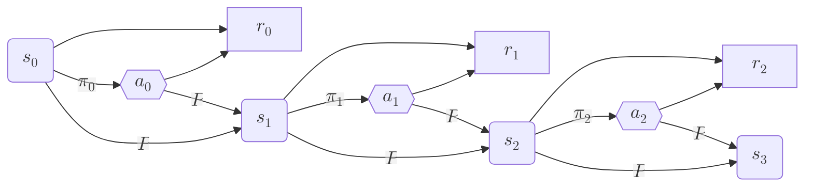

# Graphs

Graphs are made with https://mermaid.js.org/syntax/flowchart.html

```bash
pbpaste | mmdc -i - -o trajectory.png -b transparent
```

## Trajectories


```mermaid
graph LR
    S0($$s_0$$) -- $$\pi_0$$ --> A0{{$$a_0$$}}
    S0 & A0 --> R0[$$r_0$$]
    A0 & S0 -- $$P$$ --> S1($$s_1$$)
    S1 -- $$\pi_1$$ --> A1{{$$a_1$$}}
    S1 & A1 --> R1[$$r_1$$]
    A1 & S1 -- $$P$$ --> S2($$s_2$$)
    S2 -- $$\pi_2$$ --> A2{{$$a_2$$}}
    S2 & A2 --> R2[$$r_2$$]
    A2 & S2 -- $$P$$ --> S3($$s_3$$)
```

